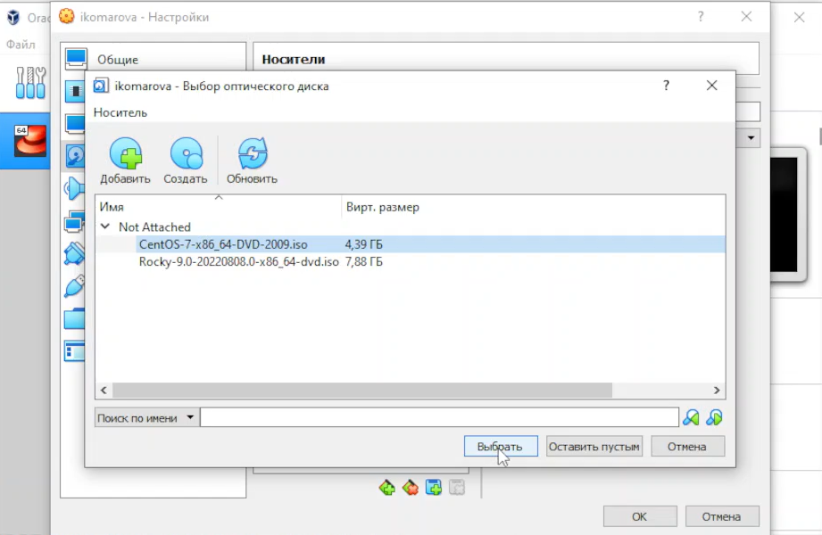
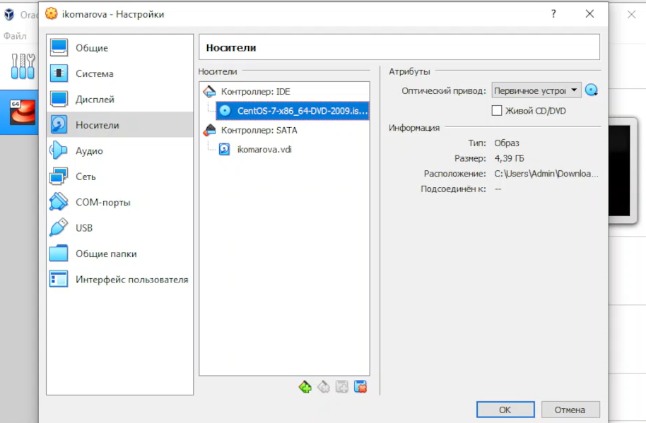

# Лабораторная работа №1. 
## Установка и конфигурация операционной системы на виртуальную машину

## Выполнила студентка группы НФИбд-02-19: Комарова Ирина Сргеевна 1032192866

## Задание
    Целью данной работы является приобретение практических навыков установки операционной системы на виртуальную машину, настройки минимально необходимых для дальнейшей работы сервисов.

## Теоретическое введение
	Лабораторная работа подразумевает установку на виртуальную машину VirtualBox (https://www.virtualbox.org/) операционной системы Linux (дистрибутив Rocky (https://rockylinux.org/) или CentOS (https://www.centos.org/)).

## Ход работы.
Приступила к настройке виртуальной машины.
Указала имя и тип ОС:

Указала объем памяти:

Указала "создать новый виртуальный жесткий диск":

Указала его тип:

Указала формат хранения:

Имя и размер файла:

Видим, что виртуальная машина создана.

Добавила носитель (поскольку у меня не работает Rocky, устанавливала CentOS)

Запустила виртуальную машину и перешла к дальнейшей настройке.
Определила язык:

Скорректировала раскладку:

Пространство хранения оставила по умолчанию.

Выбрала для установки доп. программы:

Сняла отметку с kdump.

Прописала хост.

Создала пользователя с паролем.

Дождалась установки и перезагрузила виртуальную машину, приняла лицензионное соглашение.

Приступила к работе в терминале.
Поскольку неверно назвала пользователя, создала еще одного. Также посмотрела имя хоста.

Выполнила команду dmesg.

Передо мной стояла задача найти с помощью команды grep некоторую информацию, что я и сделала.

    

## Вывод 
    Я установила операционную систему в виртуальную машину и провела минимальные настройки.

## Библиография
1. Методические материалы курса. “Информационная безопасность компьютерных сетей” Кулябов Д. С.,Королькова А. В., Геворкян М. Н.